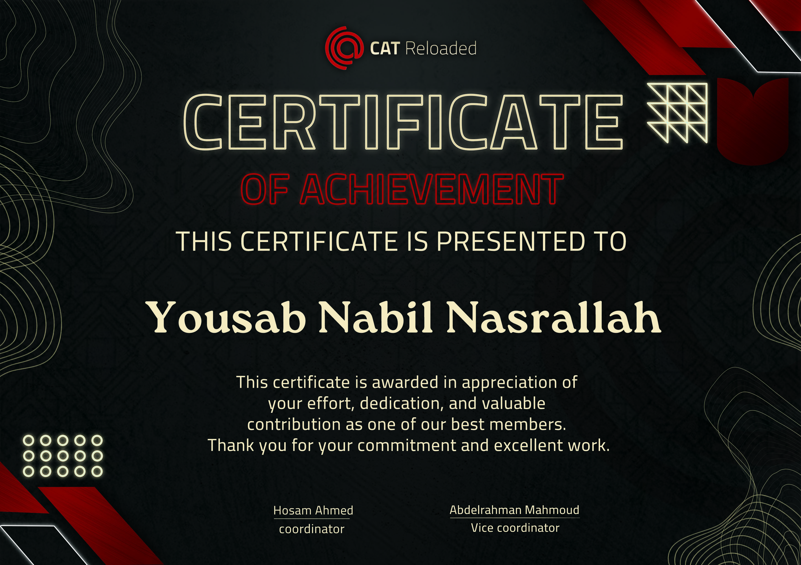

# 🐱 CAT Reloaded — Task Submissions

**Computer Scince circle**

*Weekly DSA & project task submissions for the CAT Reloaded structured learning roadmap.*

---

## 🏆 Top Member — May

> I am humbly proud to be selected as one of the **Top Members** in the computer scince circle.

---

## 📖 About This Repository

This repo contains my weekly task submissions for **CAT Reloaded**'s structured learning roadmap that covers one data structure or algorithm per week, paired with LeetCode problem sets, mini-projects, and instructor review sessions.

Each week's directory holds:

- 📸 **LeetCode screenshot** — proof of submission for that week's DSA problem(s)
- 📁 **Additional deliverables** — mini-projects, reports, or any other tasks assigned that week

---

## 📂 Repository Structure

---

## 📅 Weekly Progress

| Week | Topic | LeetCode | Extra Tasks |
|------|-------|----------|-------------|
| 01 | recap on pointer and oop | ✅ | mini project |
| 02 | time/space complixty + Stack | ✅ | — |
| 03 | Queue + Linked List | ✅ | — |
| 04 | recap on Linked list | ✅ | — |
| 05 | sorting alogrithems | ✅ | — |
| 06 | frequancy array + pre/post fix sum | ✅ | — |
| 07 | two pointers ad-hocs | ✅ | — |

> *Table updates each week as tasks are submitted.*

---

## 🧠 What I'm Learning

The circle covers core CS fundamentals in a structured, week-by-week format so far we covered:

- **Data Structures** — Stacks, Queues, Linked Lists
- **Algorithms** — Sorting
- **Problem Solving** — frequancy array , prefix/postfix sum , two pointers , add-hocs
---

## 💬 My Experience with CAT Reloaded

My time with CAT Reloaded has been genuinely positive. The structured pacing, peer community, and instructor review sessions make it one of the best ways I've found to build a solid DSA foundation alongside my engineering studies. Being selected as a **top member** for May was a meaningful milestone that reflects the effort I've put in — and the motivation to keep going.

---

## 👤 About Me

**Yousab** — Computer Engineering Student

- Passionate about systems programming, hardware-software integration, and problem solving
- Neovim + Linux daily driver
- Exploring embedded systems, gpu programming, and competitive programming

---

*once a Catian, Always a Catian*

